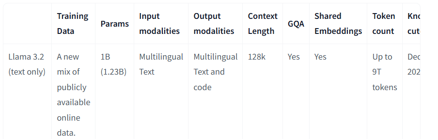
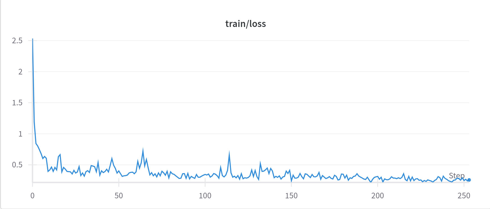
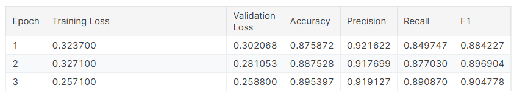
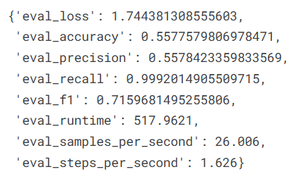
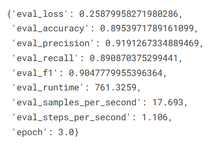
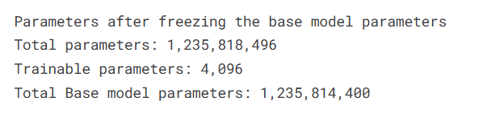

## Task - 1

### Project: Transfer Learning and Evaluation of the Llama 3.2-1B/Gemma Model

---

#### **1. Model Selection and Parameter Calculation**

- **Selected Model:** [Llama 3.2-1B](https://huggingface.co/meta-llama/Llama-3.2-1B)
- **Parameter Calculation:**  
  
  - **Calculated Parameters:** `1,235,814,400`
  - **Reported Parameters (in paper):** `1.23 Billion` 
    

        
    

  **Comparison:** Since the paper does not explicitly provide the exact number of parameters for the Llama 3.2-1B, we compare the approximate parameter count mentioned in the paper with the parameters calculated through the code. Upon calculation, the parameters are approximately similar, validating the correctness of our implementation and alignment with the model architecture described in the paper.

---

#### **2. Fine-Tuning Process**

- **Datasets:**  
  - **Classification Task:** SST-2 (Sentiment Analysis)  

- **Train-Test Split:**  
  - Split ratio: 80% train, 20% test  
  - Sampling: Stratified sampling

- **Fine-Tuning Process:**  
  1. Classification Task: SST-2  
     - Loaded pre-trained Llama 3.2-1B using AutoModelForSequenceClassification.

     

        
     

     

        
     

      
     
---

#### **3. Evaluation Metrics**

##### **Classification (SST-2)**  
- Metrics:  
  - **Accuracy**: Measures overall correctness.  
  - **Precision**: Measures the ratio of correctly predicted positive observations to the total predicted positives.  
  - **Recall**: Measures the ratio of correctly predicted positive observations to the all positives in the dataset.  
  - **F1 Score**: Harmonic mean of precision and recall.  

  | **Pretrained (Zero-shot)** | **Fine-tuned**       |
  |--------------------|------------------------|
  | |  |

---

#### **4. Model Parameters After Fine-Tuning**

> **Note:** In fine-tuning we are adding a task specific head to the output of the pre-trained `Llama 3.2-1B model`(base model). While importing 

  1. Classification Task: SST-2 
  
  - Pre-trained model parameters: `1,235,814,400`  
  - Fine-tuned model parameters: `1,235,818,496`  
  

    
  

  - **Conclusion:** The total number of parameters in the pre-trained model and fine-tuned model are different due to the addition of task-specific layer. The base model parameters remain the same, and the additional parameters are due to the task-specific head added during fine-tuning and are only trained on the task-specific dataset.

---

#### **5. Model Upload to Hugging Face**

Fine-tuned models are uploaded to the 🤗 Hub: 
  - [Llama 3.2-1B Fine-Tuned on SST-2](https://huggingface.co/bp03/Classification_SST2_Llama_3.2_1B_Model/tree/main)

---

#### **6. Analysis of Results**

1. Classification Task: SST-2
    - **Higher Scores in Fine-Tuned Models:**  
      - The fine-tuned models exhibit higher scores compared to the pre-trained models on the zero-shot evaluation. This is because the fine-tuned models are more task-specific and have learned the patterns specific to the SST-2 dataset.
      - The fine-tuned models have a task-specific head that is trained on the SST-2 dataset, which helps in capturing the sentiment patterns effectively.
      - The fine-tuned models are more specialized for the SST-2 task, leading to better performance compared to the zero-shot evaluation.

    - **Understanding Parameter Behavior:**  
      - The number of parameters in the fine-tuned model increases due to the addition of task-specific layers which has a total of 4096 parameters.
      - The base model parameters remain the same, and the additional parameters are only trained on the task-specific dataset.
      - The base model parameters are freezed and only the task-specific head is trained on the task-specific dataset.

        
 

    - **Zero-Shot vs. Fine-Tuned Performance:**
      - Zero-shot models generalize poorly on specialized tasks like sentiment analysis or question answering whereas fine-tuned models are more task-specific and exhibit better performance on the respective tasks.

        | **Pretrained (Zero-shot)** | **Fine-tuned**      |
        |--------------------|------------------------|
        | |  |

